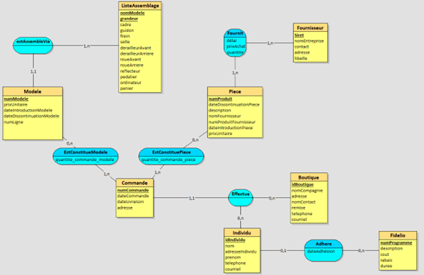

# VeloMax

## Organization of the A/E diagram

The entity Order is linked to 3 associations:
- The associations IsModelConstitute and IsPieceConstitute which allow to know the quantity of models and pieces per order and which are respectively linked to the entities Model and Piece.
- the association Performs which links the order to the customer: the customer is either a store (entity Shop), or an Individual (entity Individual), from where this ternary relation: an individual or a store performs as many orders as it wishes, and an order is performed by only one customer (either an individual, or a store).
The Fidelio entity: this is the program from which individuals can benefit by joining, hence the association between the individual and Fidelio.
The entity Supplier: the suppliers are the people who supply us with parts, so we have the association supplied which reads Part and Supplier. We find in this association the quantity supplied, the purchase price, and the time that it will take (delay) to supply these parts
The entity AssemblyList: the list of assemblies details the various components (type of handlebar, brakes, saddle...) constituting a certain model of bicycle. It makes it possible to know with which parts a model is built and is thus linked to this entity via the association estAssembleVia.

## Logical Data Model

Piece = (numProduit VARCHAR(50), dateDiscontinuationPiece DATE, description VARCHAR(150), nomFournisseur VARCHAR(50), numProduitFournisseur VARCHAR(50), dateIntroductionPiece DATE, prixUnitaire INT);

Fournisseur = (Siret VARCHAR(50), nomEntreprise VARCHAR(50), contact VARCHAR(50), adresse VARCHAR(50), libelle INT);

Boutique = (idBoutique VARCHAR(50), nomCompagnie VARCHAR(50), adresse VARCHAR(150), nomContact VARCHAR(50), remise INT), telephone VARCHAR(50), courriel VARCHAR(150));

Individu = (idIndividu VARCHAR(50), nom VARCHAR(50), adresseIndividu VARCHAR(150), prenom VARCHAR(50), telephone VARCHAR(50), courriel VARCHAR(50));

Fidelio = (numProgramme VARCHAR(50), description VARCHAR(150), cout INT, rabaisINT, duree INT));

ListeAssemblage = (nomModele VARCHAR(50), grandeur VARCHAR(50), cadre VARCHAR(50), guidon VARCHAR(50), frein VARCHAR(50), selle VARCHAR(50), derailleurAvant VARCHAR(50), derailleurArriere VARCHAR(50), roueAvant VARCHAR(50), roueArriere VARCHAR(50), reflecteur VARCHAR(50), pedalier VARCHAR(50), ordinateur VARCHAR(50), panier VARCHAR(50));

Modele = (numModele VARCHAR(50), prixUnitaireINT, dateIntroductionModele DATE, dateDiscontinuationModele DATE, numLigne VARCHAR(50), #(nomModele, grandeur));

Commande = (numCommande VARCHAR(50), dateCommande DATE, dateLivraison DATE, adresse VARCHAR(50), #idBoutique, #idIndividu);

EstConstituePiece = (#numProduit, #numCommande, quantite_commande_piece INT);

Fournit = (#numProduit, #Siret, délai VARCHAR(50), prixAchat INT, quantite INT);

Adhere = (#idIndividu, dateAdhésion VARCHAR(50), #numProgramme);

EstConstitueModele = (#numModele, #numCommande, quantite_commande_modele INT);

## Database populating options
The tables were all created and populated from MySQL. The majority of our tables were filled via Excel data export.
The filling was designed to demonstrate the functionality of our code. For example, we created an individual whose subscription was about to end (individual subscribed to the Fidelio program for almost 1 year) in order to show that we could display the individuals whose subscriptions were about to end.
## Coding options
The code has been designed so that the same methods can be used several times for different purposes:
- Create Spare Parts, Individual and Company customers, Suppliers, Orders with one Creation method
- Delete them with the Delete method
- Modify them with the Modify method
Thanks to the methods RecoverColumnName and RecoverColumnType, we recover the name and the type of the variables according to the name of the table. We use these two methods in the creation, deletion and modification, so we just have to specify the name of the table to perform one of the operations in the table we want.
Then, using the selection method, we write a query (in the form of a string) as if we were on MySQL . This method is executed for each effective statistic.
Then, in order not to open the connection to the SQL database in each method, we open it only once in the Main.
For the XML export, it is necessary to create classes corresponding to the table (or to a table join) that we want to export in XML, so we just created 2 classes (one to export the suppliers, and one to export the stocks of parts according to the suppliers) in order to show that the XML export was working, with the objective to keep a clean and understandable code. 
Concerning the export in Json, we can export any table, table join, ... by writing our request and specifying the name of the file we will create.
